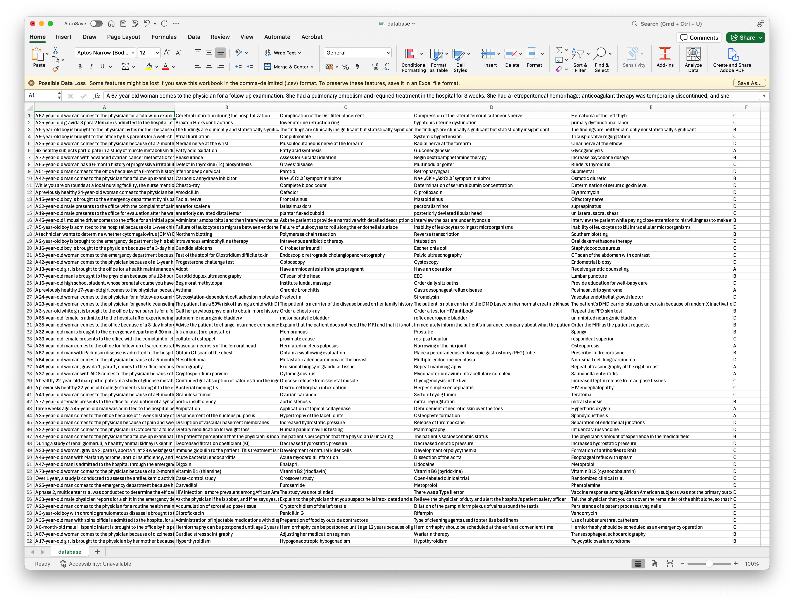

# Database evaluation
Evaluate PodGPT, PodGPT with Retrieval-augmented Generation (RAG), or ChatGPT on your own database!

## 💻 Installation
In addition to the [**PodGPT dependencies**](https://github.com/vkola-lab/PodGPT/blob/main/requirements.txt), please make sure to install the following packages:
```bash
pip install pgvector
pip install flask-sqlalchemy
pip install psycopg2
```

## 📖 Prepare your own database
We used the MMLU Professional Medicine database as an example here:
<p align="center">
  <a href="https://www.medrxiv.org/content/10.1101/2024.07.11.24310304v2"> </a> 
</p>
To prepare your own database, please make sure you have:

1. `question`: the question is in the first column (`column A`) of our demo database.
2. `options`: we have four options (A, B, C, and D) in our demo database, from `column B` to `column E`.
3. `answer`: The ground truth answer is located in the fifth column (`column F`) of our demo database.

### Tutorials:
1. First, please use your own 🤗 Hugging Face [READ and WRITE](https://huggingface.co/settings/tokens) tokens in the [config_podgpt.yml file](https://github.com/vkola-lab/PodGPT/blob/main/PodGPT_Database_Inference/config_podgpt.yml#L9-L10).
2. Please change the CSV file name to yours in the [config_benchmark.yml file](https://github.com/vkola-lab/PodGPT/blob/main/PodGPT_Database_Inference/config_benchmark.yml#L2).
3. If you have more `options` or you want to change the prompt format, you need to modify
   - `database_format` function in the [benchmark_utils.py](https://github.com/vkola-lab/PodGPT/blob/main/PodGPT_Database_Inference/utils/benchmark_utils.py)
   - `ground truth answer` extraction in the eval_utils.py ([this line](https://github.com/vkola-lab/PodGPT/blob/main/PodGPT_Database_Inference/utils/eval_utils.py#L81) and [this line](https://github.com/vkola-lab/PodGPT/blob/main/PodGPT_Database_Inference/utils/eval_utils.py#L101))
   - The range of your options `option_range` in the [vllm_utils.py](https://github.com/vkola-lab/PodGPT/blob/main/PodGPT_Database_Inference/utils/vllm_utils.py#L204)

Please note that for the answer extraction codes, we will use regular expression to extract the best option from the model's responses, for example, extract `B` from `The most likely cause of this patient's symptoms is:\n\nB. Cholesterol embolization\n\nExplanation:\nThe patient's presentation with decreased urinary output, malaise, and mottled, reticulated purplish discoloration of the feet (livedo reticularis) after a recent cardiac catheterization with stenting suggests a systemic embolic phenomenon. The laboratory findings of elevated serum creatinine (4.2 mg/dL) and the presence of intravascular spindle-shaped vacuoles on renal biopsy are consistent with cholesterol embolization. Cholesterol embolization, also known as atheroembolism, can occur after invasive vascular procedures, such as cardiac catheterization, and can cause renal dysfunction, skin lesions, and other systemic symptoms. The presence of eosinophilia (11% eosinophils) also supports this diagnosis, as it is a common finding in patients with cholesterol embolization.\n\nThe other options are less likely:\nA. Renal papillary necrosis is typically associated with analgesic abuse, diabetes, or sickle cell disease, and is not directly related to the patient's recent cardiac catheterization.\nC. Eosinophilic granulomatosis with polyangiitis (Churg-Strauss syndrome) is a systemic vasculitis that can cause renal dysfunction and eosinophilia, but it is typically associated with a history of asthma, eosinophilia, and other systemic symptoms, which are not mentioned in the case.\nD. Polyarteritis nodosa is a systemic vasculitis that can cause renal dysfunction and skin lesions, but it is typically associated with a history of hypertension, kidney disease, and other systemic symptoms, which are not mentioned in the case. Additionally, the presence of intravascular spindle-shaped vacuoles on renal biopsy is more consistent with cholesterol embolization than polyarteritis nodosa.`.

## 🚀 Inference and benchmarking
```bash
python main.py --mode podgpt --rag True --eval_pretrain False
```
1. `--mode`: Evaluate PodGPT or ChatGPT: `podgpt`/`chatgpt`. The default is `podgpt`.
2. `--rag`: Whether to use RAG database and pipeline: `True`/`False`. The default is `True`.
3. `--eval_pretrain`: Evaluate the original pre-trained model: `True`/`False`. The default is `True`.<br>
   Please note that if you set `--eval_pretrain` to `True`, the original pre-trained model will be evaluated.<br>
   If you set `--eval_pretrain` to `False`, the PodGPT model will be evaluated.<br>

## Issues
<summary>To enable vLLM distributed inference, run the following command in your terminal:</summary>

	
	export VLLM_WORKER_MULTIPROC_METHOD=spawn
	

Please note that this command is **unnecessary** if you are using a **single GPU** for inference. It is only required for **distributed inference** across multiple GPUs.<br>
For **multi-GPU inference** and **CUDA memory release**, please check [**this solution**](https://github.com/vllm-project/vllm/issues/1908#issuecomment-2238320273) for detailed guidance.

## 🏞️ Structure of the code
At the root of this folder, you will see:
```text
├── main.py
├── config_podgpt.yml
├── config_benchmark.yml
├── config_chatgpt.yml
├── lib
│   ├── config.py
│   ├── database.py
│   ├── evaluation.py
│   ├── model_loader.py
│   └── pipeline.py
├── benchmark
│   └── database.csv
└── utils
    ├── answer_utils.py
    ├── benchmark_utils.py
    ├── eval_utils.py
    ├── utils.py
    └── vllm_utils.py
```
