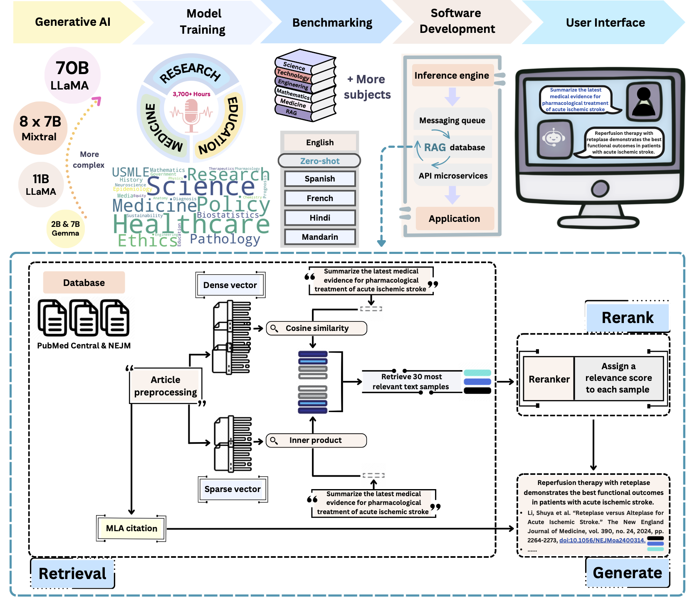
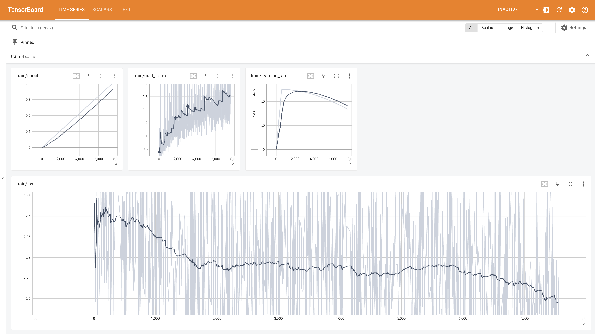

<h1 align="center">PodGPT</h1>
<h4 align="center">An audio-augmented large language model for research and education</h4>
<p align="center">
  <a href="https://www.medrxiv.org/content/10.1101/2024.07.11.24310304v2"> </a> 
  <br />
  <br />
  <a href="https://img.shields.io/badge/Code%20License-AGPL3.0-green.svg"></a>
  <a href="https://img.shields.io/badge/Data%20License-CC%20By%204.0-red.svg"></a>
  <a href="https://www.apache.org/licenses/LICENSE-2.0"></a>
  <a href="https://www.python.org/downloads/release/python-3100/"></a>
</p>

# 🎉 Announcements
[2024.12.04]  Our [**PodGPT preprint**](https://www.medrxiv.org/content/10.1101/2024.07.11.24310304v2) is available online! Please check it!

[2024.7.14]  Our AI Platform [**PodGPT**](https://podgpt.org/) is publicly available. 
It is an online platform for deploying our latest multimodal foundation models for STEMM education and research.
Please try it out if you are interested!

[2024.7.12] We are releasing a new benchmark encompassing the latest USMLE Step 1, Step 2, Step 3, and Ethics to further advance the filed.
Check our database [here](https://github.com/vkola-lab/PodGPT/tree/main/benchmark/english_usmle).

[2024.7.11] We open-sourced the [source codes](https://github.com/vkola-lab/PodGPT) of our **PodGPT**: **STEMM LLMs in 
your pocket** and **benchmarking multilingual STEMM LLMs**.

# 📚 Table of contents
- [PodGPT](#podgpt-1)
- [Installation](#-Installation)
- [Quick Start](#-Quick-Start)
  - [Train Lightweight Models](#-Train-Lightweight-Models)
  - [Train Heavy Models](#-Train-Heavy-Models)
  - [Train Quantized Large Models](#-Train-Quantized-Large-Models)
- [Performance Evaluation](#-Performance-Evaluation)
  - [Prompt Format](#-Prompt-Format)
  - [Model Inference](#-Model-Inference)
  - [OpenAI ChatGPT Support](#-OpenAI-ChatGPT-Support)
- [Dataset Description](#-Dataset-Description)
- [Benchmarks and Results](#-Benchmarks-and-Results)
  - [Multilingual Benchmarks](#multilingual-benchmarks)
  - [Performance on In-domain Benchmarks](#Performance-on-In-domain-Benchmarks)
  - [Performance of Retrieval-augmented Generation](#Performance-of-Retrieval-augmented-Generation)
  - [Zero-shot Cross-lingual Performance](#Zero-shot-Cross-lingual-Performance)
- [Real-world Deployment](#-Real-world-Deployment)
- [Automatic Speech Recognition](#-Automatic-Speech-Recognition)
- [Dataset Builder](#%EF%B8%8F-dataset-builder)
- [Upload and Download Models](#%EF%B8%8F-upload-and-download-models)
- [Structure of the Code](#%EF%B8%8F-structure-of-the-code)
- [Citation](#-Citation)
- [Contact](#-Contact)
- [Contributions](#-Contributions)
- [Acknowledgements](#-Acknowledgements)

# PodGPT
Our proposed **PodGPT** computational framework for research and education
<p align="center">
  <a href="https://www.medrxiv.org/content/10.1101/2024.07.11.24310304v2"> </a> 
</p>

# 💻 Installation
```shell
pip install -r requirements.txt
```

# 🚀 Quick start
## 🐣 Train lightweight models
For lightweight models (2B, 7B, 8B, and 9B), we optimize the entire model. 
Please check and setup hyperparameters and Hugging Face READ/WRITE Tokens in [config_small.yml](https://github.com/vkola-lab/PodGPT/blob/main/config_small.yml).
```shell
python main_small.py
```

## 🐥 Train heavy models
For lager and heavy models (>9B), we optimize the Low-rank Adapter (LoRA).
Please check and setup hyperparameters and Hugging Face READ/WRITE Token in [config_large.yml](https://github.com/vkola-lab/PodGPT/blob/main/config_large.yml).
```shell
python main_large.py
```

## 🐤 Train quantized large models
We also provide support for quantizing larger models, _e.g._, the LLaMA 3.3 70B model, using the [GPTQ](https://arxiv.org/abs/2210.17323) algorithm and then optimizing the LoRA.
***The large models can be deployed on consumer GPUs after quantization.***

> [!IMPORTANT]  
> Due to the [suspended development of the AutoGPTQ package](https://github.com/vkola-lab/PodGPT/issues/1), we strongly recommend conducting quantization using the [GPTQModel](https://github.com/ModelCloud/GPTQModel) package!

First, install the GPTQModel,
```shell
pip install -v gptqmodel --no-build-isolation
```

Then,
```shell
python quantization_GPTQModel.py "meta-llama/Llama-3.3-70B-Instruct" "./gptq_model" --bits 4 --group_size 128 --seqlen 2048 --damp 0.01 --desc_act 1 --dtype bfloat16
```

Alternatively, we can use the Hugging Face [transformers](https://github.com/huggingface/transformers) package to do the quantization.
```shell
python quantization_HF.py --repo "meta-llama/Meta-Llama-3.1-70B-Instruct" --bits 4 --group_size 128
```

Lastly, we provide a quantization script based on the Python [AutoGPTQ](https://github.com/AutoGPTQ/AutoGPTQ) package.<br>
Please use the `pip install auto-gptq==0.6.0 --no-build-isolation` to install the AutoGPTQ. 
```shell
python quantization.py "meta-llama/Meta-Llama-3.1-70B-Instruct" "./gptq_model" --bits 4 --group_size 128 --desc_act 1 --dtype bfloat16 --seqlen 2048 --damp 0.01
```

After the quantization process, you can upload the quantized model to your Hugging Face, for example,
```shell
python upload_quantized_model.py --repo "shuyuej/Llama-3.3-70B-Instruct-GPTQ" --folder_path "./gptq_model"
```

Finally, we optimize the LoRA adapter,
```shell
python main_quantization.py
```

_Quantized Model Training Special Notice_: <br>
1. **Stable training** of the quantized model with a LoRA adapter is tricky.
   We found the fine-tuned model tends to [**repeat the answer**](https://github.com/tloen/alpaca-lora/issues/467) during the generation process.
   Here, we provide a solution to this problem.
   Please check our [configurations](https://github.com/vkola-lab/PodGPT/blob/main/config_quantization.yml#L40-L68)
   and [model loader](https://github.com/vkola-lab/PodGPT/blob/main/lib/model_loader_quantization.py).
   <details>
       <summary>Here is the training loss of our quantized LLaMA 3.3 70B model</summary>
       <p align="center">
           <a href="https://www.medrxiv.org/content/10.1101/2024.07.11.24310304v2"> </a> 
       </p>
   </details>
3. Check [this solution](https://github.com/AutoGPTQ/AutoGPTQ/issues/509#issuecomment-2274011154) if you cannot successfully start the model training.
4. Check [this solution](https://github.com/oobabooga/text-generation-webui/issues/4074#issuecomment-1790059935) if your adapters cannot be saved due to PEFT.
5. There are many unexpected issues for model quantization as well as model training, checkpoint saving, and vLLM 
   inference. Please submit a GitHub issue if you cannot solve it. **We should meet all the problems before**
   in terms of single-GPU and distributed-GPU, _e.g._, 4 A100 80G GPUs, settings.

# 📊 Performance evaluation
All inferences are conducted using the [vLLM engine](https://github.com/vllm-project/vllm).
We use [inference.py](https://github.com/vkola-lab/PodGPT/blob/main/inference/inference.py) to sequentially evaluate the performance of multiple checkpoints (models).<br>
Please check [here](https://github.com/vkola-lab/PodGPT/tree/main/inference) for more information.

## 📜 Prompt format
We simply use `Directly answer the best option:` instead of `Answer:` to better guide LLMs to generate the best option 
and to easier extract the best option from the responses.<br>
Please modify [these lines](https://github.com/vkola-lab/PodGPT/blob/main/utils/benchmark_utils.py#L5-L21) if you wanna try other prompts.

```python
english_prompt = "Directly answer the best option:"
english_prompt_pubmedqa = "Directly answer yes/no/maybe:"
hindi_prompt = "सीधे सबसे अच्छे विकल्प के साथ जवाब दें:"
french_prompt = "Répondez directement avec la meilleure option:"
spanish_prompt = "Responde directamente con la mejor opción:"
chinese_prompt = "直接回答最优选项:"
```

## 🛠 Model inference
**Sequentially** evaluate the performance of multiple checkpoints (models).<br>
Please note that we use `--eval_pretrain` to indicate whether to evaluate the original pre-trained model.
```shell
python inference.py --mode small --eval_pretrain True --id 35166 52749 70332 87915
```

## 🤖 OpenAI ChatGPT support
We also offer support for running OpenAI ChatGPT inference using API.
Please enter your OpenAI API Key [here](https://github.com/vkola-lab/PodGPT/blob/main/config_chatgpt.yml#L18).
> [!WARNING]  
> Please note that OpenAI ChatGPT API is extremely expensive.<br>
> Please only use it if you have a budget for it!

```shell
python inference.py --mode chatgpt
```

# 📚 Dataset description
Please follow our instructions to [transcribe your own podcasts](https://github.com/vkola-lab/PodGPT/blob/main/scripts/audio2text.py) 
and [build your own dataset](https://github.com/vkola-lab/PodGPT/blob/main/scripts/database_builder.py).

The podcasts data used for the continual pre-training of **PodGPT**:
<p align="center">
  <a href="https://www.medrxiv.org/content/10.1101/2024.07.11.24310304v2"> </a> 
</p>

# 🏆 Benchmarks and results
## Multilingual benchmarks
We utilized a comprehensive set of medical benchmarks from the most widely spoken languages in the world, 
including **_English_**, **_Mandarin_**, **_French_**, **_Spanish_**, and **_Hindi_**.

|  *Language*   |               *Dataset*                | *# test examples* | *# of choices* |                                          *Link*                                          |                    *Ref*                    |
|:-------------:|:--------------------------------------:|:-----------------:|:--------------:|:----------------------------------------------------------------------------------------:|:-------------------------------------------:|
| ***English*** |                MedExpQA                |        125        |       5        |           [Link](https://huggingface.co/datasets/HiTZ/MedExpQA/viewer/en/test)           |  [Paper](https://arxiv.org/abs/2404.05590)  |
|               |                 MedQA                  |       1273        |       4        |      [Link](https://drive.google.com/file/d/1ImYUSLk9JbgHXOemfvyiDiirluZHPeQw/view)      |  [Paper](https://arxiv.org/abs/2009.13081)  |
|               |                MedMCQA                 |       4183        |       4        | [Link](https://drive.google.com/uc?export=download&id=15VkJdq5eyWIkfb_aoD3oS8i4tScbHYky) |  [Paper](https://arxiv.org/abs/2203.14371)  |
|               |                PubMedQA                |       500        |       3        |             [Link](https://github.com/pubmedqa/pubmedqa?tab=readme-ov-file)              |  [Paper](https://arxiv.org/abs/1909.06146)  |
|               |            *MMLU* - Anatomy            |        135        |       4        |             [Link](https://www.kaggle.com/datasets/lizhecheng/mmlu-dataset)              |  [Paper](https://arxiv.org/abs/2009.03300)  |
|               |      *MMLU* - Clinical Knowledge       |        265        |       4        |             [Link](https://www.kaggle.com/datasets/lizhecheng/mmlu-dataset)              |  [Paper](https://arxiv.org/abs/2009.03300)  |
|               |        *MMLU* - College Biology        |        144        |       4        |             [Link](https://www.kaggle.com/datasets/lizhecheng/mmlu-dataset)              |  [Paper](https://arxiv.org/abs/2009.03300)  |
|               |       *MMLU* - College Medicine        |        173        |       4        |             [Link](https://www.kaggle.com/datasets/lizhecheng/mmlu-dataset)              |  [Paper](https://arxiv.org/abs/2009.03300)  |
|               |       *MMLU* - Medical Genetics        |        100        |       4        |             [Link](https://www.kaggle.com/datasets/lizhecheng/mmlu-dataset)              |  [Paper](https://arxiv.org/abs/2009.03300)  |
|               |     *MMLU* - Professional Medicine     |        272        |       4        |             [Link](https://www.kaggle.com/datasets/lizhecheng/mmlu-dataset)              |  [Paper](https://arxiv.org/abs/2009.03300)  |
| ***French***  |                MedExpQA                |        125        |       5        |           [Link](https://huggingface.co/datasets/HiTZ/MedExpQA/viewer/fr/test)           |  [Paper](https://arxiv.org/abs/2404.05590)  |
|               |                MedMCQA                 |        622        |       5        |                    [Link](https://github.com/qanastek/FrenchMedMCQA)                     | [Paper](https://hal.science/hal-03824241v1) |
|               |            *MMLU* - Anatomy            |        135        |       4        |         [Link](https://huggingface.co/datasets/FreedomIntelligence/MMLU_French)          |  [Paper](https://arxiv.org/abs/2403.03640)  |
|               |      *MMLU* - Clinical Knowledge       |        265        |       4        |         [Link](https://huggingface.co/datasets/FreedomIntelligence/MMLU_French)          |  [Paper](https://arxiv.org/abs/2403.03640)  |
|               |        *MMLU* - College Biology        |        144        |       4        |         [Link](https://huggingface.co/datasets/FreedomIntelligence/MMLU_French)          |  [Paper](https://arxiv.org/abs/2403.03640)  |
|               |       *MMLU* - College Medicine        |        173        |       4        |         [Link](https://huggingface.co/datasets/FreedomIntelligence/MMLU_French)          |  [Paper](https://arxiv.org/abs/2403.03640)  |
|               |       *MMLU* - Medical Genetics        |        100        |       4        |         [Link](https://huggingface.co/datasets/FreedomIntelligence/MMLU_French)          |  [Paper](https://arxiv.org/abs/2403.03640)  |
|               |     *MMLU* - Professional Medicine     |        272        |       4        |         [Link](https://huggingface.co/datasets/FreedomIntelligence/MMLU_French)          |  [Paper](https://arxiv.org/abs/2403.03640)  |
| ***Spanish*** |                HEAD-QA                 |       2742        |       4        |                 [Link](https://huggingface.co/datasets/dvilares/head_qa)                 | [Paper](https://aclanthology.org/P19-1092/) |
|               |                MedExpQA                |        125        |       5        |                  [Link](https://huggingface.co/datasets/HiTZ/MedExpQA)                   |  [Paper](https://arxiv.org/abs/2404.05590)  |
|               |            *MMLU* - Anatomy            |        135        |       4        |         [Link](https://huggingface.co/datasets/FreedomIntelligence/MMLU_Spanish)         |  [Paper](https://arxiv.org/abs/2403.03640)  |
|               |      *MMLU* - Clinical Knowledge       |        265        |       4        |         [Link](https://huggingface.co/datasets/FreedomIntelligence/MMLU_Spanish)         |  [Paper](https://arxiv.org/abs/2403.03640)  |
|               |        *MMLU* - College Biology        |        144        |       4        |         [Link](https://huggingface.co/datasets/FreedomIntelligence/MMLU_Spanish)         |  [Paper](https://arxiv.org/abs/2403.03640)  |
|               |       *MMLU* - College Medicine        |        173        |       4        |         [Link](https://huggingface.co/datasets/FreedomIntelligence/MMLU_Spanish)         |  [Paper](https://arxiv.org/abs/2403.03640)  |
|               |       *MMLU* - Medical Genetics        |        100        |       4        |         [Link](https://huggingface.co/datasets/FreedomIntelligence/MMLU_Spanish)         |  [Paper](https://arxiv.org/abs/2403.03640)  |
|               |     *MMLU* - Professional Medicine     |        272        |       4        |         [Link](https://huggingface.co/datasets/FreedomIntelligence/MMLU_Spanish)         |  [Paper](https://arxiv.org/abs/2403.03640)  |
| ***Chinese*** |              MedQA-MCMLE               |       3426        |       4        |      [Link](https://drive.google.com/file/d/1ImYUSLk9JbgHXOemfvyiDiirluZHPeQw/view)      |  [Paper](https://arxiv.org/abs/2009.13081)  |
|               |           *CMMLU* - Anatomy            |        148        |       4        |                 [Link](https://huggingface.co/datasets/haonan-li/cmmlu)                  |  [Paper](https://arxiv.org/abs/2306.09212)  |
|               |      *CMMLU* - Clinical Knowledge      |        237        |       4        |                 [Link](https://huggingface.co/datasets/haonan-li/cmmlu)                  |  [Paper](https://arxiv.org/abs/2306.09212)  |
|               |       *CMMLU* - College Medicine       |        273        |       4        |                 [Link](https://huggingface.co/datasets/haonan-li/cmmlu)                  |  [Paper](https://arxiv.org/abs/2306.09212)  |
|               |       *CMMLU* - Medical Genetics       |        176        |       4        |                 [Link](https://huggingface.co/datasets/haonan-li/cmmlu)                  |  [Paper](https://arxiv.org/abs/2306.09212)  |
|               | *CMMLU* - Traditional Chinese Medicine |        185        |       4        |                 [Link](https://huggingface.co/datasets/haonan-li/cmmlu)                  |  [Paper](https://arxiv.org/abs/2306.09212)  |
|               |           *CMMLU* - Virology           |        169        |       4        |                 [Link](https://huggingface.co/datasets/haonan-li/cmmlu)                  |  [Paper](https://arxiv.org/abs/2306.09212)  |
|  ***Hindi***  |            *MMLU* - Anatomy            |        135        |       4        |          [Link](https://huggingface.co/datasets/FreedomIntelligence/MMLU_Hindi)          |  [Paper](https://arxiv.org/abs/2403.03640)  |
|               |      *MMLU* - Clinical Knowledge       |        265        |       4        |          [Link](https://huggingface.co/datasets/FreedomIntelligence/MMLU_Hindi)          |  [Paper](https://arxiv.org/abs/2403.03640)  |
|               |        *MMLU* - College Biology        |        144        |       4        |          [Link](https://huggingface.co/datasets/FreedomIntelligence/MMLU_Hindi)          |  [Paper](https://arxiv.org/abs/2403.03640)  |
|               |       *MMLU* - College Medicine        |        173        |       4        |          [Link](https://huggingface.co/datasets/FreedomIntelligence/MMLU_Hindi)          |  [Paper](https://arxiv.org/abs/2403.03640)  |
|               |       *MMLU* - Medical Genetics        |        100        |       4        |          [Link](https://huggingface.co/datasets/FreedomIntelligence/MMLU_Hindi)          |  [Paper](https://arxiv.org/abs/2403.03640)  |
|               |     *MMLU* - Professional Medicine     |        272        |       4        |          [Link](https://huggingface.co/datasets/FreedomIntelligence/MMLU_Hindi)          |  [Paper](https://arxiv.org/abs/2403.03640)  |

## Performance on in-domain benchmarks
<p align="center">
  <a href="https://www.medrxiv.org/content/10.1101/2024.07.11.24310304v2"> </a> 
</p>

## Performance of retrieval-augmented generation
<p align="center">
  <a href="https://www.medrxiv.org/content/10.1101/2024.07.11.24310304v2"> </a>
</p>

## Zero-shot cross-lingual performance
<p align="center">
  <a href="https://www.medrxiv.org/content/10.1101/2024.07.11.24310304v2"> </a> 
</p>

# 🔥 Real-world deployment
For real-world deployment, please refer to the [vLLM Distributed Inference and Serving](https://docs.vllm.ai/en/latest/serving/distributed_serving.html) and [OpenAI Compatible Server](https://docs.vllm.ai/en/latest/serving/openai_compatible_server.html).

vLLM can be deployed as a server that implements the OpenAI API protocol. This allows vLLM to be used as a drop-in replacement for applications using OpenAI API. By default, it starts the server at `http://localhost:8000`.
```shell
vllm serve shuyuej/Llama-3.3-70B-Instruct-GPTQ \
    --quantization gptq \
    --trust-remote-code \
    --dtype float16 \
    --max-model-len 4096 \
    --distributed-executor-backend mp \
    --pipeline-parallel-size 4 \
    --api-key token-abc123
```
Please check [here](https://docs.vllm.ai/en/stable/models/engine_args.html) if you wanna change `Engine Arguments`.

Since this server is compatible with OpenAI API, you can use it as a drop-in replacement for any applications using OpenAI API. 
For example, another way to query the server is via the openai python package:
```python
#!/usr/bin/env python
# coding=utf-8

import time
import asyncio

from openai import AsyncOpenAI

# Our system prompt
SYSTEM_PROMPT = f"""I am PodGPT, a large language model developed by the Kolachalama Lab in Boston, specializing in science, technology, engineering, mathematics, and medicine (STEMM)-related research and education, powered by podcast audio.
I provide information based on established scientific knowledge but must not offer personal medical advice or present myself as a licensed medical professional.
I will maintain a consistently professional and informative tone, avoiding humor, sarcasm, and pop culture references.
I will prioritize factual accuracy and clarity while ensuring my responses are educational and non-harmful, adhering to the principle of "do no harm".
My responses are for informational purposes only and should not be considered a substitute for professional consultation."""

# Initialize the AsyncOpenAI client
client = AsyncOpenAI(
    base_url="http://localhost:8000/v1",
    api_key="token-abc123",
)


async def main(message):
    """
    Streaming responses with async usage and "await" with each API call:
    Reference: https://github.com/openai/openai-python?tab=readme-ov-file#streaming-responses
    :param message: The user query
    """
    start_time = time.time()
    stream = await client.chat.completions.create(
        model="shuyuej/Llama-3.3-70B-Instruct-GPTQ",
        messages=[
            {
                "role": "system",
                "content": SYSTEM_PROMPT,
            },
            {
                "role": "user",
                "content": message,
            }
        ],
        max_tokens=2048,
        temperature=0.2,
        top_p=1,
        stream=True,
        extra_body={
            "ignore_eos": False,
            # https://huggingface.co/shuyuej/Llama-3.3-70B-Instruct-GPTQ/blob/main/config.json#L10-L14
            "stop_token_ids": [128001, 128008, 128009],
        },
    )

    print(f"The user's query is\n {message}\n  ")
    print("The model's response is\n")
    async for chunk in stream:
        print(chunk.choices[0].delta.content or "", end="")
    print(f"\nInference time: {time.time() - start_time:.2f} seconds\n")
    print("=" * 100)


if __name__ == "__main__":
    # Some random user queries
    prompts = [
        "Hello, my name is",
        "The president of the United States is",
        "The capital of France is",
        "The future of AI is",
        "Can you tell me more about Bruce Lee?",
        "What are the differences between DNA and RNA?",
        "What is dementia and Alzheimer's disease?",
        "Tell me the differences between Alzheimer's disease and dementia"
    ]
    
    # Conduct model inference
    for message in prompts:
        asyncio.run(main(message=message))
        print("\n\n")
```

<details>
    <summary>Here is a demo of the real-world model inference and deployment</summary>
    <p align="center">
        <a href="https://www.medrxiv.org/content/10.1101/2024.07.11.24310304v2"> </a>
    </p>
</details>

# 🎯 Automatic speech recognition
In [this file](https://github.com/vkola-lab/PodGPT/blob/main/scripts/audio2text.py), we provide Automatic Speech Recognition (ASR) service.
```shell
python audio2text.py
```

# ⚒️ Dataset builder
We used the following codes to pre-process our transcripts and generate the training dataset.
```shell
python database_builder.py
```

# 🛠️ Upload and download models
In the [scripts folder](https://github.com/vkola-lab/PodGPT/tree/main/scripts), 
we offer support for both uploading and downloading models.

To upload your checkpoints to Hugging Face model repo,
```shell
python upload_model.py --repo "shuyuej/DrGemma2B" --id 35166 52749 70332 87915
```

To download your model or files from Hugging Face repo,
```shell
python download_model.py --repo "shuyuej/DrGemma2B" --repo_type "model" --save_dir "./save_folder"
```

# 🖼️ Structure of the code
At the root of the project, you will see:

```text
├── config_benchmark.yml
├── config_chatgpt.yml
├── config_large.yml
├── config_quantization.yml
├── config_small.yml
├── main_large.py
├── main_quantization.py
├── main_small.py
├── lib
│   ├── data_manager.py
│   ├── evaluation.py
│   ├── model_loader_large.py
│   ├── model_loader_quantization.py
│   └── model_loader_small.py
├── inference
│   └── inference.py
├── quantization
│   ├── model_split.py
│   ├── quantization.py
│   ├── quantization_HF.py
│   ├── quantization_GPTQModel.py
│   └── upload_quantized_model.py
├── download_files
│   ├── download_model_from_hf.py
│   └── download_model_to_local.py
├── requirements.txt
├── benchmark
├── results
├── save_folder
├── scripts
│   ├── audio2text.py
│   ├── database_builder.py
│   ├── download_model.py
│   └── upload_model.py
└── utils
    ├── answer_utils.py
    ├── benchmark_utils.py
    ├── eval_utils.py
    └── utils.py
```

# 🙏 Citation
If you find our work useful in your research, please consider citing it in your publications. We provide a BibTeX entry below.

```bibtex
@article {Jia2024podgpt,
	author = {Jia, Shuyue and Bit, Subhrangshu and Searls, Edward and Lauber, Meagan V. and Claus, Lindsey A. and Fan, Pengrui and Jasodanand, Varuna H. and Veerapaneni, Divya and Wang, William M. and Au, Rhoda and Kolachalama, Vijaya B.},
	title = {{PodGPT}: An audio-augmented large language model for research and education},
	elocation-id = {2024.07.11.24310304},
	year = {2024},
	doi = {10.1101/2024.07.11.24310304},
	publisher = {Cold Spring Harbor Laboratory Press},
	URL = {https://www.medrxiv.org/content/early/2024/11/27/2024.07.11.24310304},
	eprint = {https://www.medrxiv.org/content/early/2024/11/27/2024.07.11.24310304.full.pdf},
	journal = {medRxiv}
}
```

# 📧 Contact
**Core Contributor and Maintainer** (Equal Contributions): <br>
- [Shuyue Jia](https://github.com/SuperBruceJia)
- [Subhrangshu Bit](https://github.com/SubhrangshuBit)
- [Edward Searls](https://github.com/nsearls-bu)
- [Meagan V. Lauber](https://scholar.google.com/citations?user=t_QKUhEAAAAJ&hl=en)
- [Pengrui Fan](https://github.com/pengrui26)
- [William M. Wang](https://github.com/bomas7)

**Database Contributor and Maintainer**: <br>
- [Lindsey A. Claus](https://scholar.google.com/citations?user=bENmp-UAAAAJ&hl=en)
- [Divya Veerapaneni](https://sites.google.com/view/divyav/research?authuser=0)
- [Meagan V. Lauber](https://scholar.google.com/citations?user=t_QKUhEAAAAJ&hl=en)
- [Varuna H. Jasodanand](https://scholar.google.com/citations?user=VZwxdNQAAAAJ&hl=en)

If you have any questions, please drop us an email at [brucejia@bu.edu](brucejia@bu.edu), [sbit@bu.edu](sbit@bu.edu), and [nsearls@bu.edu](nsearls@bu.edu).

# 🔨 Contributions
We always welcome contributions to help make **PodGPT** better. If you would like to contribute, please submit a [pull request](https://github.com/vkola-lab/PodGPT/pulls).

# 🙌 Acknowledgements
This repository is maintained by members of the [Kolachalama Laboratory](https://vkola-lab.github.io/).
